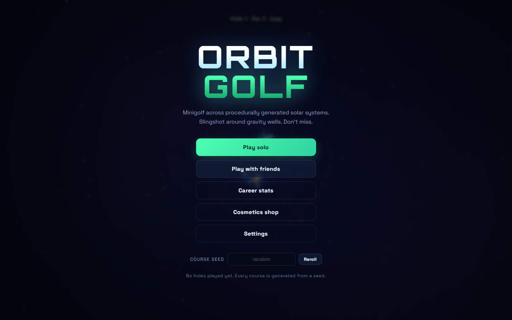

# Orbit Golf

2D minigolf across procedurally generated solar systems. Slingshot your ball between
planets, use gravity wells to curve around obstacles, and drop it in the cup on a
distant world — with friends watching your ball as a live ghost.



## Running it

```bash
npm install
npm run dev          # Vite dev server on :5173
```

Open <http://localhost:5173>. There is **no game server** — the whole app is a static
client. Single-player needs nothing else. Multiplayer uses Supabase Realtime, so to play
with friends locally, copy `.env.example` to `.env.local` and fill in your Supabase
project's URL and publishable key (see below).

Anyone can deep-link straight into a lobby with `?room=NEBULA`.

## Deploying (Vercel + Supabase, no server)

Multiplayer runs entirely on **Supabase Realtime** (Presence + Broadcast) — no server
process, no database tables, no auth. That makes the whole thing a static site you can
host anywhere, including Vercel's free tier.

1. In your Supabase project, grab the **Project URL** and the **publishable (anon) key**
   from *Project Settings → API*. Realtime is on by default and needs no tables or RLS for
   public Broadcast/Presence.
2. In Vercel → *Project → Settings → Environment Variables*, add:
   - `VITE_SUPABASE_URL`
   - `VITE_SUPABASE_PUBLISHABLE_DEFAULT_KEY`
3. Redeploy. That's it — Vercel builds the static client (`npm run build`), and the client
   talks to Supabase directly from the browser.

Both env vars are public client-side values (the publishable key is designed to ship in
the browser). Without them, single-player still works and multiplayer shows a
"not configured" notice instead of failing silently.

### How it works without a server

- **Course seed** is derived from the room code (`hashString(code)`), so every client in a
  room generates the identical solar system with zero coordination.
- **Presence** carries the player roster and each player's score.
- **Broadcast** carries live ball positions (ghosts) and the host-authored room state.
- The **host** is elected deterministically as the earliest joiner — every client computes
  the same host from Presence — and owns phase/hole/config plus hole advancement. Clients
  accept room state only from the current host, so a modified client can't hijack a room.

## How to play

| Action | Control |
| --- | --- |
| Putt | Drag **from the ball** away from where you want to go, release (slingshot) |
| Zoom | Mouse wheel, `+` / `-`, or the HUD buttons |
| Pan | Right-drag (or shift-drag) |
| Fit whole course | `F` |
| Recenter on ball | `C` |
| Replay hole | `R` |
| Concede hole | `X` |
| Multiplayer | `M` |
| Career stats | `T` |
| Settings | `Esc` |

Touch works too: one finger to aim and putt, two fingers to pinch-zoom and pan.

The dotted line is a real forward simulation of your shot — not an approximation — so
it accounts for every gravity well and bounce. Its colour tells you the predicted
outcome: **green** sinks it, **blue** is still flying, **orange** leaves the map,
**red** hits a black hole. Shorten or disable it in Settings if it makes things too easy.
Settings also has a **colorblind mode**, which swaps that palette for a colorblind-safe
one and adds short end-of-line labels (SINK/FLY/OUT/HOLE) so the outcome never depends on
colour alone.

There's a low-volume ambient music bed, runtime-synthesised like the sound effects (no
audio files to ship). It has its own **Music** volume slider in Settings, independent of
the SFX volume, so you can run them at different levels or mute either one.

## Course generation

Every course comes from a 32-bit seed; the same seed always produces the same holes,
which is how multiplayer keeps everyone on an identical course. Difficulty ramps with
the hole number:

| Holes | Tier | What shows up |
| --- | --- | --- |
| 1–5 | Easy | 2–3 planets, tight spacing |
| 6–12 | Medium | 3–5 planets, first orbiting bodies |
| 13–22 | Hard | 5–7 planets, black holes, repulsors |
| 23+ | Extreme | 7–10 bodies, multiple movers and hazards |

Surfaces behave differently: **ice** is slippery and bouncy, **lava** is grabby, **gas
giants** swallow momentum, **repulsors** push you away, and **black holes** eat your
ball for a penalty stroke. Leave the dashed boundary circle and you're lost in space —
also a penalty stroke, replayed from where you last came to rest.

A shot takes as long as it takes. Slow transfers and multi-orbit approaches are the
point of the game, so nothing is cut short for being lengthy. The only time limit is
that a ball which has touched *nothing at all* for 60 seconds is declared adrift and
costs a stroke — any bounce off any surface resets that timer.

Mass is `density × radius²` and `G = 560`, so surface gravity is the same on every
planet of a given material regardless of size — but a big planet has a far deeper well
to escape. That's what makes planet size read as difficulty at a glance.

## Multiplayer

Rooms live entirely on Supabase Realtime — no game server (see *Deploying* above). The
room code determines the course seed, so everyone in a room plays the same solar system.
Positions broadcast at ~20 Hz and render as translucent ghosts with name tags.

**Lobby and host.** Joining a room drops you into a **lobby**, not straight into a game.
The first player in is the **host** (shown with a ★ crown) and controls:

- **Start game** — moves the whole room from lobby to hole 1.
- **Aim guide policy** — *free choice* (each player's own setting), *everyone on*, or
  *everyone off* (competitive, no aim preview for anyone).
- **Allow hole restarts** — when off, nobody can retry a hole.
- **Kick** — remove any player; they're bounced back to the title with a notice.

Host role auto-transfers to the earliest remaining player if the host leaves. Because the
host is elected deterministically from Presence, every client agrees who it is, and
clients only accept room state from the current host — so a modified client can't start,
kick, or change settings for others. Once playing, each player presses **Ready** after
finishing a hole, which opens a waiting panel listing who's Ready and who's still playing;
a still-playing player also sees an "X/Y ready" indicator in the HUD. The **host** advances
everyone to the next hole with a **Next hole** button, which only unlocks once every player
is Ready — if someone gets truly stuck, the host can kick them to unblock the room.

Scoring is kept honest in a lobby: restarting a hole (`R`) carries your strokes over and
adds a penalty stroke instead of wiping the slate, and once you've holed out the
"Replay hole" button is hidden so a finished score can't be rewritten. Solo play keeps
the free restart.

## Career stats and achievements

Everything you do is tracked locally (`localStorage`, this device only — no accounts, no
server). Press `T` for the career sheet: furthest hole, holes sunk, aces, under-par
count, average strokes, best at-or-under-par streak, best run, shots, distance
travelled, longest single shot, bounces, balls lost, black-hole deaths, holes played
with friends, and time played — plus a full scorecard breakdown from ace to double bogey.

There are 17 achievements, from **First Light** (sink one hole) through **Long Bomb**
(a single shot over 5,000 units), **Grand Tour** (sink on rock, ice, lava and gas
worlds), **Spaghettified** (feed a ball to a black hole) and **Event Horizon** (reach
hole 30). Locked ones show a progress bar; unlocks pop a toast as they happen.

"Reset career" in the stats footer wipes stats and achievements after a confirmation.

## Stardust and cosmetics

Finishing a hole earns **Stardust**, a local currency scaled by how well you played —
sinking under par pays more, an ace pays a big bonus, and conceding a hole still earns a
small consolation amount. Spend it in the **Cosmetics Shop**, opened from the HUD icon bar
or the title screen, on ball skins: different body colours, glow and ghost-ring accents,
priced from free (the default Classic skin) up to the priciest, Champion Gold. Whatever
skin you have equipped restyles your own ball and is also shown to other players, so your
ghost is recognisable in a crowd. Like career stats, this is entirely device-local
(`localStorage`, no accounts, no server) — there's nothing to cheat but your own wallet.

## Recent players

A full friend list needs accounts, auth and a database, and the room server is
deliberately in-memory — so this is the account-free version. Everyone you share a room
with is saved locally: name, colour, how many sessions you've played together, the last
room code and when. Star someone to pin them to the top, hit **Join** to drop straight
back into the last room you shared, or **✕** to forget them.

The tradeoff is that identity is just a name — there's no way to tell two players with
the same name apart, and the list doesn't sync between your own devices. Upgrading to
real accounts later would mean adding Supabase Auth and a table.

## Tests

```bash
npm test         # headless generator + physics + stats + multiplayer checks, no browser
npm run build
npm run test:e2e # drives the real game in Chromium, writes screenshots/
npm run audit    # samples 16k generated holes + 23k simulated shots, prints a report
```

`npm run audit` is the tool to reach for when changing generation or difficulty. It
reports cup-surface distribution per tier, hazard frequency, world sizes, and simulated
shot distances — which is how the achievement list was confirmed to be fully reachable.

`npm test` runs three headless suites. The **course** suite generates 150 courses and
asserts they're well-formed (no overlapping planets, cup never on a hazard, tee in
bounds), deterministic, that balls come to rest, and that holes are reachable. The
**stats** suite covers scoring buckets, streaks, penalties, best-run selection,
achievement unlocking, persistence and legacy migration, and the recent-players roster.
The **multiplayer** suite runs several real `RealtimeClient`s against an in-memory relay
transport and checks host election, the lobby→playing gate, config authority, kick, hole
advancement, and host reassignment — all the logic that used to be the server's job.

`npm run test:e2e` serves the production build, plays and sinks a hole, checks penalties
and the no-contact timer, opens the career sheet, reloads to confirm stats persist, then
forces the in-memory relay and drives a real client plus a simulated in-page peer to
verify the lobby, host controls, config propagation, start, ghosts, kick, and advancement
— 59 checks, with screenshots.

## Layout

```
src/
  core/      seeded RNG, vector maths
  game/      generator, physics, settings, stats, friends, cosmetics, the Game orchestrator
  render/    camera, starfield, gravity field, particles, draw routines
  net/       Supabase Realtime client, transport abstraction, shared types
  audio/     runtime-synthesised sound effects (no audio assets)
test/        headless suites (course, stats, multiplayer)
scripts/     test runners
```

## Not built yet

Accounts and a real cross-device friend list, per-course leaderboards, replays, and
mobile UI polish beyond the basics.
